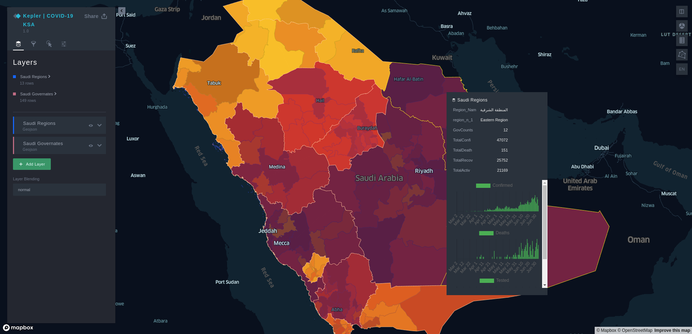

# Saudi COVID-19 map using [Kepler.gl](https://kepler.gl/) | [Live demo](https://kepler-covid.mapsaudi.com/)

This is a react-based map web app built with [Kepler.gl](https://kepler.gl/). It visualizes the data of two layers:
1. [COVID-19 Cases In Saudi Arabia Regions](https://mapsaudi.com/layers/geonode_data:geonode:covidbyregion) that includes statistics about the total confirmed, deaths, recovered, and active COVID-19 cases for each region.

2. [COVID-19 Cases In Saudi Arabia Governorates](https://mapsaudi.com/layers/geonode_data:geonode:sagov) that includes the same statistics about COVID-19 but for each governorate located in a specific region.

Check a [live demo](http://kepler-covid.mapsaudi.com/) of the app.

***

## Available Scripts

### **Development Mode:**

#### `npm install`
- Installs the required dependencies from `package.json`.

#### `npm start`
- Runs the app in the development mode. 
- Open [http://localhost:3000](http://localhost:3000) to view it in the browser.
- The page will reload if you make edits.

### **Production Mode:**

#### `docker-compose up -d`
- Builds a docker image with the minified build version of the app which is done by `npm run build` command internally.
- It correctly bundles the app in production mode and optimizes the build for the best performance.
- Open [http://localhost:7070/](http://localhost:7070/) to view it in the browser.

#### `docker-compose up -d --build`
- Build a new docker image associated with the latest changes that you would made.

***

### **How to create a Map app with Kepler.gl**

In this guide, you shall learn how to build and visualize a large amount of location data in your browser using [kepler.gl](https://kepler.gl/) and [ReactJS](https://reactjs.org/).

You will be able to perform data analysis in Kepler.gl by adding data to a map, fetching layers from a web service (e.g. [GeoServer](http://geoserver.org/)), adding filters, and more cool features to explore.

* [Introduction](docs/index.md)
* [Installation and Requirements](docs/installation.md)
* [Integrate Kepler into React](docs/integrateKepler.md)
* [Fetch and display data on map](docs/display-data-on-map.md)
* [Additional tweaks and customizations](docs/additional-tweaks.md)

***

### **Edit this guide**

This guide is built using [Material for MkDocs](https://squidfunk.github.io/mkdocs-material/).

To view it locally:
1. `virtualenv -p python3 env_name` Create a [Python Virtual Environment](https://packaging.python.org/guides/installing-using-pip-and-virtual-environments/)
2. `source <env-path>/bin/activate` Activate the environment
3. `pip install -r requirements.txt` Install the required packages.
4. `mkdocs serve` Serve the guide on [http://localhost:8000/](http://localhost:8000/).
