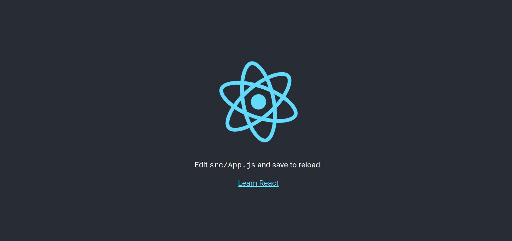

# Building a Map app with Kepler.gl

## :material-chevron-right-circle: Installation and Requirements

In order to make a map app like the [Saudi Kepler's map](http://mapapps.cloud:7070/) that is mentioned in the introduction section, you need to install some requirements as follows.

### **1. Install ReactJS**
- Install **Node > 10.15.0** from the their [official website](https://nodejs.org/en/) on your machine.
- Create a React-based project. You can use **Create React app** but feel free to use any other toolchain.

!!! tip
    If you don't know about Integrated Toolchains, here're the [Recommended Toolchains by ReactJS](https://reactjs.org/docs/create-a-new-react-app.html#recommended-toolchains).

- In your terminal, run the following to create a React app.
```shell
npx create-react-app my-app
cd my-app
npm start
```
- You should get the initial React page as below.



-  For sake of simplicity, remove the unnecessary files and imports so that we have a simple startup code in our `App.js`.
``` javascript
import React from 'react';

function App() {
  return (
    <div>
      <header>
        <h1>Saudi map using Kepler</h1>
      </header>
    </div>
  );
}

export default App;
```

### **2. Install Kepler.gl**

- Install kepler.gl with its dependencies.
```shell
npm install --save kepler.gl react-palm redux react-redux styled-components
```
- Kepler.gl is built upon [mapbox](https://www.mapbox.com/) so, you will need to create a [Mapbox Access Token](https://docs.mapbox.com/help/glossary/access-token/) to use it.

!!! note
    After creating an account, you should see there's a **Default public token**. You can use it or if you wish, generate a new one.


- In the project directory, create a file with `.env.local` extension and inside it, create an environment variable called `REACT_APP_MAPBOX_API` and store your Mapbox access token as below.
```shell
REACT_APP_MAPBOX_API='Your token'
```

Now, you are ready to import kepler.gl and initialize it into your app.
