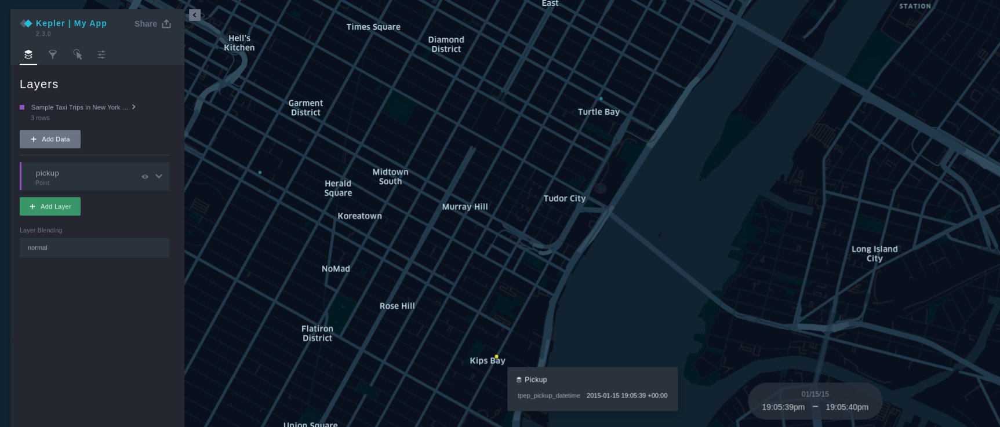

# Building Map app with Kepler.gl

## :material-chevron-right-circle: Integrate Kepler.gl into React app

In the following steps, we will add and state the required implementation to get Kepler.gl up and running inside a React app.

!!! note
    All the mentioned code below should be implemented inside `App.js` file.

### **1. Mount Kepler reducer**
- Kepler.gl uses Redux to manage its internal state, along with [react-palm](https://github.com/btford/react-palm) middleware to handle side effects.
- In `App.js`, we will import the following:
    * { `createStore, combineReducers, applyMiddleware` } from redux.
    * { `keplerGlReducer` } from kepler.gl/reducers.
    * { `taskMiddleware` } from react-palm/tasks.

- Then initialize the reducer alongside the state as well.
```javascript
import { createStore, combineReducers, applyMiddleware } from "redux"
import keplerGlReducer from "kepler.gl/reducers"
import { taskMiddleware } from "react-palm/tasks"

const reducers = combineReducers({
  keplerGl: keplerGlReducer
});

const store = createStore(reducers, {}, applyMiddleware(taskMiddleware));
```

### **2. Mount Kepler component**
- As before, import the following in `App.js`:
```javascript
import KeplerGl from "kepler.gl"

const Map = () => {
  <KeplerGl
    id="yourAppId"
    width={window.innerWidth}
    mapboxApiAccessToken={process.env.REACT_APP_MAPBOX_API}
    height={window.innerHeight}
    appName="yourAppName"
    version="yourAppVersion"
  />
}
```

!!! notes
    1. The `id` field must be set as it defines the prop name of the KeplerGl state that is stored in the KeplerGl reducer. For example, the state of the KeplerGl component with id `foo` is stored in `state.keplerGl.foo`.
    2. Also for the field `mapboxApiAccessToken`, it must be set otherwise, the mapbox api will not be called successfully. We used the access token that we have created and defined before in `.env.local` file in the previous section.
    3. You can set the fields `appName` and `version` to be shown in the side panel.

- You can check the rest of `KeplerGl` component props [here](https://github.com/keplergl/kepler.gl#props).

### **3. Import Redux**
- Import the following:
```javascript
import { Provider } from "react-redux"

function App() {
  return (
    <Provider store={store}>
        <Map />
    </Provider>
  );
}

export default App;
```

- Now, if you navigate to `http://localhost:3000/` (or the port you run the app on), you should see the instance of [Kepler's demo](https://kepler.gl/demo) in your app.

!!! note
    If you feel confused about where to put the code correctly, you can check the full source code at the end of this section.

### **4. Add data to the Map**
- Now as the map is loaded successfully, let's add some data to the map. In order to do so, we need to dispatch the `addDataToMap` action to add data to `keplerGlReducer`, you can check the parameters of this action [here](https://github.com/keplergl/kepler.gl#6-how-to-add-data-to-map).

!!! note
    The data that shall be added now is just a dummy data. We will use a real one in the next section.

- Add the below imports as well as sample data and configuration to `addDataToMap` action.
```javascript
import { useDispatch } from "react-redux"
import { addDataToMap } from "kepler.gl/actions"
import { useEffect } from "react"

const Map = () => {
    const dispatch = useDispatch();

    const sampleTripData = {
        fields: [
            {name: 'tpep_pickup_datetime', format: 'YYYY-M-D H:m:s', type: 'timestamp'},
            {name: 'pickup_longitude', format: '', type: 'real'},
            {name: 'pickup_latitude', format: '', type: 'real'}
        ],
        rows: [
            ['2015-01-15 19:05:39 +00:00', -73.99389648, 40.75011063],
            ['2015-01-15 19:05:39 +00:00', -73.97642517, 40.73981094],
            ['2015-01-15 19:05:40 +00:00', -73.96870422, 40.75424576],
        ]
    };

    const sampleConfig = {
        visState: {
            filters: [
                {
                    id: 'me',
                    dataId: 'test_trip_data',
                    name: 'tpep_pickup_datetime',
                    type: 'timeRange',
                    enlarged: true
                }
            ]
        }
    }

    useEffect(() => {
        dispatch(
            addDataToMap({
                datasets: {
                    info: {
                        label: 'Sample Taxi Trips in New York City',
                        id: 'test_trip_data'
                    },
                    data: sampleTripData
                },
                option: {
                    centerMap: true,
                    readOnly: false,
                    keepExistingConfig: false
                },
                info: {
                    title: 'Taro and Blue',
                    description: 'This is my map'
                },
                config: sampleConfig
            })
        )
    }, [dispatch])
    
    return (
      <KeplerGl
        id="myId"
        mapboxApiAccessToken={process.env.REACT_APP_MAPBOX_API}
        width={window.innerWidth}
        height={window.innerHeight}
        appName="Kepler | My App"
      />
    )
}
```

- Now, if you navigate back to our react app, you should see three points on the map represents the Taxi Trips in New York City. You can also check the data at the side panel.



!!! warning
    The data that is passed inside `addDataToMap` into `datasets.data`, must be in the format of `fields` representing the properties of each attribute at the given data and `rows` that represents the actual data.


### **5. The final code**
- Compare it with your code if you have errors. Otherwise, Rock and roll to the next section!
```javascript
import React, { useEffect } from 'react';
import { createStore, combineReducers, applyMiddleware } from "redux"
import { taskMiddleware } from "react-palm/tasks"
import { Provider, useDispatch } from "react-redux"
import KeplerGl from "kepler.gl"
import keplerGlReducer from "kepler.gl/reducers"
import { addDataToMap } from "kepler.gl/actions"

const reducers = combineReducers({
    keplerGl: keplerGlReducer
});

const store = createStore(reducers, {}, applyMiddleware(taskMiddleware));

const Map = () => {
    const dispatch = useDispatch();
    const sampleTripData = {
        fields: [
            {name: 'tpep_pickup_datetime', format: 'YYYY-M-D H:m:s', type: 'timestamp'},
            {name: 'pickup_longitude', format: '', type: 'real'},
            {name: 'pickup_latitude', format: '', type: 'real'}
         ],
        rows: [
            ['2015-01-15 19:05:39 +00:00', -73.99389648, 40.75011063],
            ['2015-01-15 19:05:39 +00:00', -73.97642517, 40.73981094],
            ['2015-01-15 19:05:40 +00:00', -73.96870422, 40.75424576],
        ]
    };

    const sampleConfig = {
        visState: {
            filters: [
                {
                    id: 'me',
                    dataId: 'test_trip_data',
                    name: 'tpep_pickup_datetime',
                    type: 'timeRange',
                    enlarged: true
                }
            ]
        }
    }

    useEffect(() => {
        dispatch(
            addDataToMap({
                datasets: {
                    info: {
                        label: 'Sample Taxi Trips in New York City',
                        id: 'test_trip_data'
                    },
                    data: sampleTripData
                },
                option: {
                    centerMap: true,
                    readOnly: false,
                    keepExistingConfig: false
                },
                info: {
                    title: 'Taro and Blue',
                    description: 'This is my map'
                },
                config: sampleConfig
            })
        )
    }, [dispatch, sampleTripData, sampleConfig])
    
    return (
        <KeplerGl
            id="myId"
            mapboxApiAccessToken={process.env.REACT_APP_MAPBOX_API}
            width={window.innerWidth}
            height={window.innerHeight}
            appName="Kepler | My App"
        />
    )
}

function App() {
    return (
        <Provider store={store}>
            <Map />
        </Provider>
    );
}

export default App;
```

!!! info
    For more information, see Kepler's [:material-github: Github repository](https://github.com/keplergl/kepler.gl) and [:material-file-document: documentation](https://docs.kepler.gl/).
